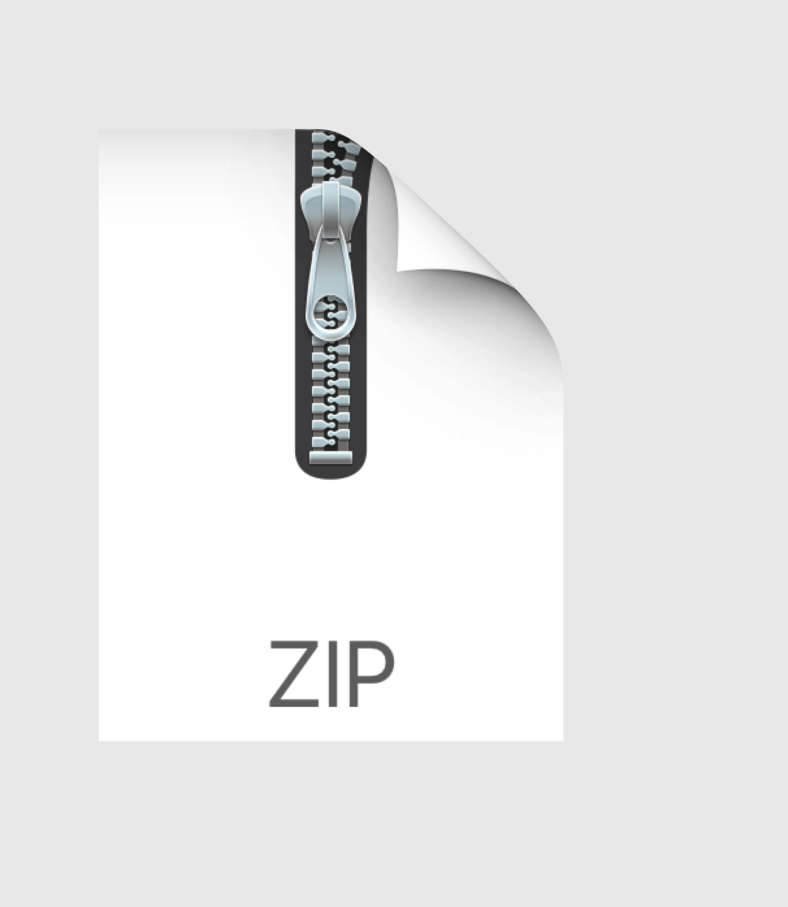

## Archive forge Organization

Coming soon... the **Archive Forge**.

# Goal

Help researchers generate better archive files. 

 --> 

# Features

- Defined file structure in the archive file.
- scientific domain specific metadata.
- Auto-fill authors, publication, institution, *etc*.
- Data and metadata extraction from [identified files](docs/identified-files.md).
- Format conversion.

# Improved [F](fair.md)indability

The metadata allows search engines and specialized database to find your data.

# Improved [A](fair.md)ccessibility

# Improved [I](fair.md)nteroperability

# Improved [R](fair.md)eproducibility

[.](./calculatorform.html)

Preview of an example of ArchiveForge generated chemistry object :
<a href=""><object data="https://img.shields.io/endpoint.svg?url=https://nmredatainitiative.github.io/demoChemedataBadge.json&link=https://chemedata.org&link=https://nmredata.org"></object></a>
